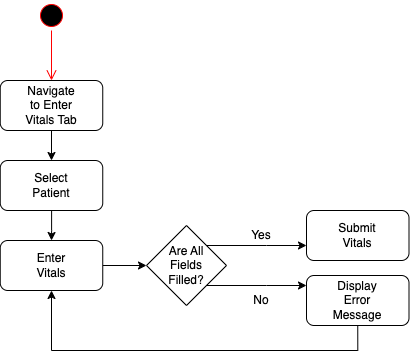
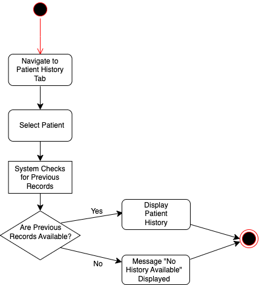
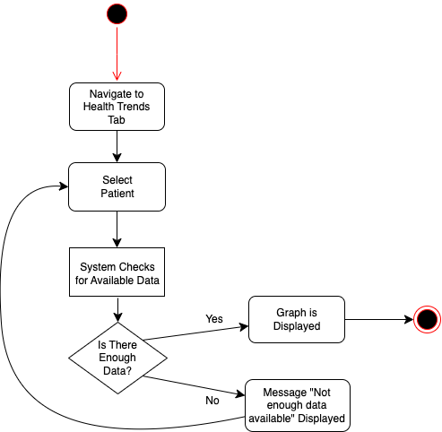

## Improving Vital Sign Documentation 
**By:** Aubrey Skinner  
**Date:** 02/12/2025  
**Course:** CIDM6330  

## Introduction
In healthcare, it is crucial to maintain accurate, easily accessible documentation. However, many home healthcare facilities do not offer effective systems for tracking patient health history. Instead, they rely on caregivers to log and keep track of vital signs independently. Relying on manual, paper-based record-keeping systems introduces a wide range of issues: data loss, illegible writing, and transcription errors. Additionally, reviewing patient history and identifying trends in a patient's health becomes difficult as there are multiple physical documents to sift through. To address these issues, I propose developing a digital system that streamlines the process of recording vital signs and offers a means to visualize trends in a patient's health. This platform will allow healthcare professionals to record vital signs directly from patient to database, reducing errors and improving accessibility. 

## Table of Contents
1. [Introduction](#introduction)
2. [Requirements Statements](#requirements-statements)
3. [User Stories](#user-stories)
4. [Use Cases](#use-cases)
5. [Features](#features)
6. [Gherkin Validation](#gherkin-validation)
7. [Specifications](#specifications)
   - [Concept](#concept)
   - [UX Notes](#ux-notes)
   - [Interfaces Controls](#interfaces-controls)
   - [Behaviors](#behaviors)
8. [Feature: Record Vitals](#feature-record-vitals)
9. [Feature: View History](#feature-view-history)
10. [Feature: View Health Trends](#feature-view-health-trends)

## Requirements Statements
### Functional Requirements
* Allow users to input vital signs (blood pressure, oxygen saturation, heart rate, weight, temperature, RR)
* Store vitals securely in a database
* Enable users to edit/correct entries
* Provide a way to visualize past vital signs in a table or graph
  
### Non-Functional Requirements
* Data must be encrypted to ensure patient confidentiality (using MySQL database encryption)
* The interface should be intuitive and require a minimal amount of training
* Allow for quick data entry to avoid disrupting patient care
  
### User Stories
1. <b>As a CNA</b>, <b>I want</b> to view past vital signs in a table or graph <b>so that</b> I can visualize patient trends.  
2. <b>As a CNA</b>, <b>I want</b> to quickly record patient vital signs <b>so that</b> I can maintain accurate records without disrupting patient care.  
3. <b>As a CNA</b>, <b>I want</b> to be able to search for a patient by name <b>so that</b> I can easily input patient data.  
4. <b>As an Administrator</b>, <b>I want</b> to secure patient data using encryption <b>so that</b> confidentiality is maintaned. 

### Use Cases 
   

 
### Case 1- Record Vitals

<b>Actors:</b> CNA, Nurse 

<b>Preconditions:</b> The user must be logged in  

<b>Basic Flow:</b>  
1. Select Patient 
2. Enter Vitals 
3. Submit Vitals 
4. Data Saved  

<b>Alternative Flow:</b>
Missing Values -> Error  

<b>Postconditions:</b> Vitals saved, updates health trend (graph) 

### Case 2- View History
<b>Actors:</b> CNA, Nurse 

<b>Preconditions:</b> The user must be logged in and the patient must have a history in the system  

<b>Basic Flow:</b>
1. Select Patient
2. Navigate to the Patient History Section
3. System Displays Past Vitals 

<b>Alternative Flow:</b>
No Previous History -> Message Displaying: "No history available" 

<b>Postconditions:</b> User successfully views patient's previous vitals

### Case 3- View Health Trend Graphs
<b>Actors:</b> CNA, Nurse 

<b>Preconditions:</b> The user must be logged in, the patient has recorded vitals in the system, and the system has enough data to generate a graph/table. 

<b>Basic Flow:</b> 
1. Select Patient
2. Navigate to the Health Trends Section
3. System Displays a Graph
4. Graph is Displayed to User 

<b>Alternative Flow:</b>
Not Enough Previous History -> Message Displaying: "Not enough data available" 

<b>Postconditions:</b> User successfully views patient's health trends

### Case 4- Oversee Case
<b>Actors:</b> Case Manager 

<b>Preconditions:</b> The user must be logged in 

<b>Basic Flow:</b> 
1. Select Patient
2. Navigate to the applicable data needed
3. Review Data 

<b>Postconditions:</b> User successfully views patient's case information

### Features
1. <b>User Authentication-</b> User must be logged in to access the system
2. <b>Record Vitals-</b> Allows CNAs and Nurses to record patient vitals and have them saved
3. <b>View Patient History-</b> Allows CNAs and Nurses to view previously recorded vital signs
4. <b>View Health Trend Graphs-</b> System will generate a graph/table that allows the user to visualize patient data and health trends
5. <b>Oversee Patient's Case-</b> Allows Case Manager to review patient data
6. <b>Error Handling-</b> Missing entries or requests with no data available are handled with appropriate messages.
7. <b>Data Storage-</b> Saves patient vitals securely.

### Gherkin Validation
### Scenario 1:
<b>Feature: Record Vitals (Successful)</b> 
<b>Scenario:</b> CNA/Nurse successfully records patient vitals.  
Given the CNA or Nurse is logged in 
And has a patient selected 
When the vitals are entered correctly 
And they are submitted 
Then the system will save the vitals 
And update the patient health trend graph

### Scenario 2: 
<b>Feature: Record Vitals (Missing Values)</b>  
<b>Scenario:</b> CNA/Nurse records vitals with missing fields. 
Given the CNA or Nurse is logged in 
And has a patient selected 
When a field is left empty 
Then the system displays an error message 
And prompts the user to enter all required fields

### Scenario 3:
<b>Feature: View History (Successful)</b> 
<b>Scenario:</b> Patient history is successfully viewed. 
Given the CNA or Nurse is logged in 
And has a patient selected 
When they navigate to the patient history section 
Then the system displays the patient's history

### Scenario 4:
<b>Feature: View History (No Previous Data)</b> 
<b>Scenario:</b> CNA/Nurse attempts to view patient history when none is available. 
Given the CNA or Nurse is logged in 
And has a patient selected with no previous records 
When they navigate to the patient history section 
Then the system displays a message: "No history available"

### Scenario 5:
<b>Feature: View Health Trend Graphs (Successful)</b> 
<b>Scenario:</b> CNA/Nurse successfully views patient health trend graph. 
Given the CNA or Nurse is logged in 
And has a patient selected 
When they navigate to the health trends section 
Then the system displays a graph containing patient's health trends

### Scenario 6:
<b>Feature: View Health Trend Graphs (Not Enough Data)</b> 
<b>Scenario:</b> CNA/Nurse attempts to view patient health trend graph when there is not enough data. 
Given the CNA or Nurse is logged in 
And has a patient selected with few recorded vitals 
When they navigate to the health trends section 
Then the system displays a message: "Not enough data available"

### Scenario 7:
<b>Feature: Oversee Patient's Case (Successful)</b> 
<b>Scenario:</b> Case Manager successfully reviews patient case information. 
Given the Case Manager is logged in 
And has a patient selected 
When they navigate to the patient's recorded vitals, history, or health trend section 
Then the system displays the appropriate information

## Specifications
### Concept
This system is designed to streamline the process of recording, viewing, and visualizing patient vitals in healthcare settings (specifically home healthcare). CNAs and nurses can input vital signs, view previous records, and see trends with graphical representations. Case managers can oversee patient data to ensure proper care management.  

<b>Primary Goals:</b> 
* <b>Efficiency:</b> Reduce manual paperwork and streamline the recording of vital signs 
* <b>Accuracy:</b> Ensure vitals are logged properly and decrease the amount of potential errors 
* <b>Accessibility:</b> Provide a user-friendly interface

### UX Notes
1. <b>Ease of Use-</b>
   * Clean and minimal interface
   * Large, easy-to-read text and buttons to cater to the fast-paced work environment
   * Logical and intuitive navigation flow
2. <b>Data Visibility and Accessibility-</b>
   * Quickly find patient data (current vitals, patient history, trends) with minimal effort
   * Search functionality to find specific patient data
   * Graphical representation for easy data interpretation
3. <b>Error Handling/ Prevention-</b>
   * Clear error messages to guide users when an issue occurs

### Interfaces (Controls)
1. <b>Record Vitals Elements</b>
   * Dropdown and/or search bar for patient selection
   * Input fields for vital signs
   * Submit button to save vitals
2. <b>View History Elements</b>
   * Dropdown and/or search bar for patient selection
   * "View History" button to view previous records of selected patient
   * Filter options (date range and/or certain vitals)
3. <b>View Health Trend Graphs Elements</b>
   * Dropdown and/or search bar for patient selection
   * "View Trends" button to see graph and/or table visualization
   * Filter options (date range)
   
## Behaviors

### Feature: Record Vitals

### Record Vitals (Activity Diagram)
The Record Vitals feature allows a CNA or Nurse to enter a patient's vital signs into the system. The process is as follows (given the user is logged in):  
2. Navigate to Enter Vitals Tab
3. Select Patient
4. Enter Vitals
5. Validation Check (Decision) -> If all fields are completed, the user can submit. If field(s) are missing, an error message will be displayed.
6. Once vitals are successfully submitted, the system will update the patient history and health trend graph

### Feature: View History

### View History (Activity Diagram)
The View History feature allows a CNA or Nurse to view a patient's past recorded vital signs. The process is as follows (given the user is logged in):  
1. Navigate to the View History Tab
2. Select Patient
3. System Performs a Check for Previous Records
4. Decision Point -> If history is available, the data will be displayed. If no data is available for a given patient, the message, "No history available" will be shown.
5. If applicable, the user can view patient history

### Feature: View Health Trends

