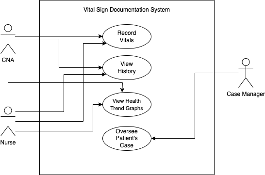

## Improving Vital Sign Documentation 
**By:** Aubrey Skinner  
**Date:** 02/12/2025  
**Course:** CIDM6330  

## Introduction
In healthcare, it is crucial to maintain accurate, easily accessible documentation. However, many home healthcare facilities do not offer effective systems for tracking patient health history. Instead, they rely on caregivers to log and keep track of vital signs independently. Relying on manual, paper-based record-keeping systems introduces a wide range of issues: data loss, illegible writing, and transcription errors. Additionally, reviewing patient history and identifying trends in a patient's health becomes difficult as there are multiple physical documents to sift through. To address these issues, I propose developing a digital system that streamlines the process of recording vital signs and offers a means to visualize trends in a patient's health. This platform will allow healthcare professionals to record vital signs directly from patient to database, reducing errors and improving accessibility. 

## Table of Contents
1. [Introduction](#introduction)
2. [Requirements Statements](#requirements-statements)
3. [User Stories](#user-stories)
4. [Use Cases](#use-cases)
5. [Features](#features)
6. [Gherkin Validation](#gherkin-validation)
7. [Specifications](#specifications)
   - [Concept](#concept)
   - [UX Notes](#ux-notes)
   - [Interfaces Controls](#interfaces-controls)
   - [Behaviors](#behaviors)
8. [Feature/Package A](#featurepackage-a)
9. [Feature/Package N](#featurepackage-n)

## Requirements Statements
### Functional Requirements
* Allow users to input vital signs (blood pressure, oxygen saturation, heart rate, weight, temperature, RR)
* Store vitals securely in a database
* Enable users to edit/correct entries
* Provide a way to visualize past vital signs in a table or graph
  
### Non-Functional Requirements
* Data must be encrypted to ensure patient confidentiality (using MySQL database encryption)
* The interface should be intuitive and require a minimal amount of training
* Allow for quick data entry to avoid disrupting patient care
  
### User Stories
1. <b>As a CNA</b>, <b>I want</b> to view past vital signs in a table or graph <b>so that</b> I can visualize patient trends.  
2. <b>As a CNA</b>, <b>I want</b> to quickly record patient vital signs <b>so that</b> I can maintain accurate records without disrupting patient care.  
3. <b>As a CNA</b>, <b>I want</b> to be able to search for a patient by name <b>so that</b> I can easily input patient data.  
4. <b>As an Administrator</b>, <b>I want</b> to secure patient data using encryption <b>so that</b> confidentiality is maintaned. 

#### Use Cases

#### Features
[Detail your features here]

#### Gherkin Validation
[Include Gherkin scenarios here]

## Specifications
#### Concept
[Write about the concept here]

#### UX Notes
[Notes about user experience design]

#### Interfaces (Controls)
[Details about user interface and controls]

## Behaviors
[Description of the system's behaviors]

#### Feature/Package A
[Include diagrams for Feature A and description]

#### Feature/Package N
[Include diagrams for Feature N and description]

