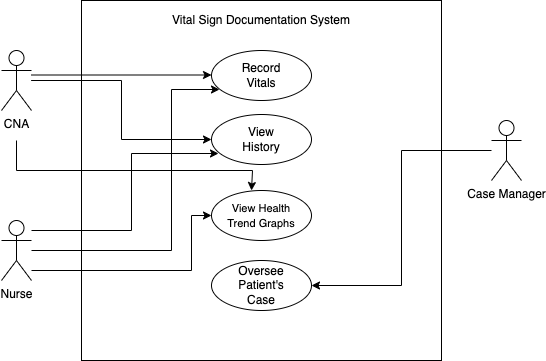

# Final Project: <i>Vital Signs Management System</i>

## Table of Contents
1. [Introduction](#introduction)
2. [Updated Problem Domain](#updated-problem-domain)
3. [UML Diagrams](#uml-diagrams)
4. [Evolution 1: Updated Requirements Statements](#evolution-1-updated-requirements-specification)
5. [Evolution 2: Updated API](#evolution-2-updated-api)
6. [Evolution 4: Migration to Django](#evolution-4-migration-to-django)
7. [Evolution 5: Full Django + Tests](#evolution-5-full-django--tests)

## Introduction
In healthcare, it is crucial to maintain accurate, easily accessible documentation. However, many home healthcare facilities do not offer effective systems for tracking patient health history. Instead, they rely on caregivers to log and keep track of vital signs independently. Relying on manual, paper-based record-keeping systems introduces a wide range of issues: data loss, illegible writing, and transcription errors. Additionally, reviewing patient history and identifying trends in a patient's health becomes difficult as there are multiple physical documents to sift through. To address these issues, I propose developing a digital system that streamlines the process of recording vital signs and offers a means to visualize trends in a patient's health. This platform will allow healthcare professionals to record vital signs directly from the patient to the database, reducing errors and improving accessibility. 
## Updated Problem Domain
In healthcare, tracking and recording vital signs accurately is critical for patient care. It determines how well you can help them as a caregiver and how their doctors can better assist them. Traditionally, paper documentation can be disorganized, prone to errors, and cause delays. This system digitizes the recording, storage, and retrieval of patient vital signs to address these issues. It provides a simple, secure, and efficient way for healthcare providers (CNAs, Nurses, etc.) to record patient vital signs, view health trends, and for case managers to oversee data for supervision. 
#### Users
* <b>Certified Nursing Assistants (CNAs)/ Nurses:</b>
  1. Record vital signs for patients
  2. View historical vital signs
  3. Analyze individualized patient trends in the form of graphs
* <b>Case Managers:</b>
  1. Oversee patients
  2. Monitor patient progress based on recorded vital signs
* <b>Key Entities:</b>
  1. Patients: Individuals receiving healthcare services
  2. Vital Signs: A set of measurements recorded during patient visits (blood pressure, heart rate, oxygen saturation, temperature, respiratory rate, and weight)
  3. Healthcare Providers: CNAs or Nurses recording vital signs
  4. Case Managers: Supervisors overseeing patient care and outcomes
#### Solution Summary:
The system uses a Django-based backend, powered by the Django REST Framework (DRF), to provide a fully RESTful API for managing patients, vital signs, and healthcare providers. It supports CRUD operations, ensuring efficient and structured handling.  
 
<b>Key Features:</b>
* Secure Data Storage: using Django's ORM and implementing best practices
* Data Validation: prevents entry errors and maintains integrity
* Simple Data Entry: workflows designed for fast use by CNAs and Nurses
* Visualization Tool: included a trend graph to help monitor patient progress
## UML Diagrams:
1. Activity Diagram 
2. Class Diagram 
3. Component Diagram 
4. Sequence Diagram 
5. State Machine 
6. Use Case Diagram 
## Evolution 1: Updated Requirements Specification
#### <b>Functional Requirements:</b>
1. CNAs/Nurses can record patient vital signs (blood pressure, heart rate, oxygen saturation, temperature, respiratory rate, and weight)
2. CNAs/Nurses and Case Managers can view a patient's previous vital signs chronologically
3. All Users can view trend graphs for vital sign data over time (allows users to see periods when a vital sign might have been elevated or lower than usual)
4. Authentication to access the system (Django's superuser authentication)

#### <b>Non-Functional Requirements:</b> 
1. Patient data must be stored securely 
2. The system must support fast read and write operations even with a growing data size 
3. UI must be simple and clean for quick data entry 
4. The system must be scalable and support an expanding number of patients and users 

## Evolution 2: Updated API
For this evolution, the API has been implemented using Django REST Framework (DRF), ensuring that CRUD operations for patients, vital signs, and healthcare providers are supported. The ERD from earlier has been utilized to validate entities, with models expressed using Django's ORM, along with serializers to handle data validation and transformation. 
ERD 
## Evolution 4: Migration to Django
## Evolution 5: Full Django + Tests
#### Ubiquitous Language Glossary
#### Gherkin Notation Expressions
#### Creation of Tests
#### Django Unit Tests for Three Use Cases
