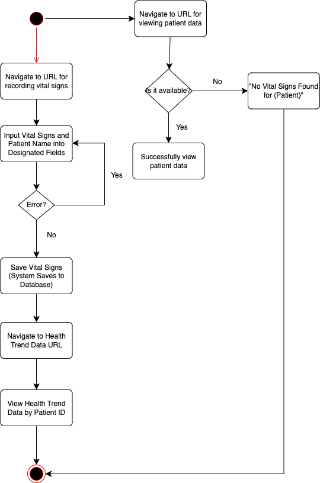
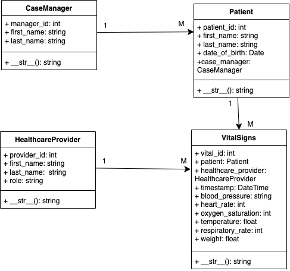
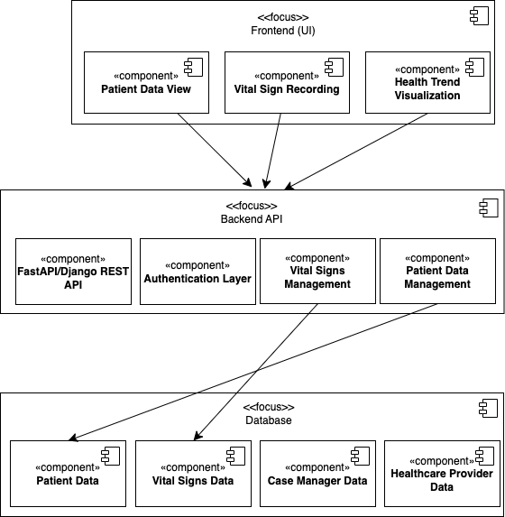

# Final Project: <i>Vital Signs Management System</i>

## Table of Contents
1. [Introduction](#introduction)
2. [Updated Problem Domain](#updated-problem-domain)
3. [UML Diagrams](#uml-diagrams)
4. [Evolution 1: Updated Requirements Statements](#evolution-1-updated-requirements-specification)
5. [Evolution 2: Updated API](#evolution-2-updated-api)
6. [Evolution 4: Migration to Django](#evolution-4-migration-to-django)
7. [Evolution 5: Full Django + Tests](#evolution-5-full-django--tests)

## Introduction
In healthcare, it is crucial to maintain accurate, easily accessible documentation. However, many home healthcare facilities do not offer effective systems for tracking patient health history. Instead, they rely on caregivers to log and keep track of vital signs independently. Relying on manual, paper-based record-keeping systems introduces a wide range of issues: data loss, illegible writing, and transcription errors. Additionally, reviewing patient history and identifying trends in a patient's health becomes difficult as there are multiple physical documents to sift through. To address these issues, I propose developing a digital system that streamlines the process of recording vital signs and offers a means to visualize trends in a patient's health. This platform will allow healthcare professionals to record vital signs directly from the patient to the database, reducing errors and improving accessibility. 
## Updated Problem Domain
In healthcare, tracking and recording vital signs accurately is critical for patient care. It determines how well you can help them as a caregiver and how their doctors can better assist them. Traditionally, paper documentation can be disorganized, prone to errors, and cause delays. This system digitizes the recording, storage, and retrieval of patient vital signs to address these issues. It provides a simple, secure, and efficient way for healthcare providers (CNAs, Nurses, etc.) to record patient vital signs, view health trends, and for case managers to oversee data for supervision. 
#### Users
* <b>Certified Nursing Assistants (CNAs)/ Nurses:</b>
  1. Record vital signs for patients
  2. View historical vital signs
  3. Analyze individualized patient trends in the form of graphs
* <b>Case Managers:</b>
  1. Oversee patients
  2. Monitor patient progress based on recorded vital signs
* <b>Key Entities:</b>
  1. Patients: Individuals receiving healthcare services
  2. Vital Signs: A set of measurements recorded during patient visits (blood pressure, heart rate, oxygen saturation, temperature, respiratory rate, and weight)
  3. Healthcare Providers: CNAs or Nurses recording vital signs
  4. Case Managers: Supervisors overseeing patient care and outcomes
#### Solution Summary:
The system uses a Django-based backend, powered by the Django REST Framework (DRF), to provide a fully RESTful API for managing patients, vital signs, and healthcare providers. It supports CRUD operations, ensuring efficient and structured handling.  
 
<b>Key Features:</b>
* Secure Data Storage: using Django's ORM and implementing best practices
* Data Validation: prevents entry errors and maintains integrity
* Simple Data Entry: workflows designed for fast use by CNAs and Nurses
* Visualization Tool: included a trend graph to help monitor patient progress
## UML Diagrams:
1. Activity Diagram   

2. Class Diagram    

3. Component Diagram   

4. Sequence Diagram   

5. State Machine   

6. Use Case Diagram   

## Evolution 1: Updated Requirements Specification
#### <b>Functional Requirements:</b>
1. CNAs/Nurses can record patient vital signs (blood pressure, heart rate, oxygen saturation, temperature, respiratory rate, and weight)
2. CNAs/Nurses and Case Managers can view a patient's previous vital signs chronologically
3. All Users can view trend graphs for vital sign data over time (allows users to see periods when a vital sign might have been elevated or lower than usual)
4. Authentication to access the system (Django's superuser authentication)

#### <b>Non-Functional Requirements:</b> 
1. Patient data must be stored securely 
2. The system must support fast read and write operations even with a growing data size 
3. UI must be simple and clean for quick data entry 
4. The system must be scalable and support an expanding number of patients and users 

## Evolution 2: Updated API
For this evolution, the API has been implemented using Django REST Framework (DRF), ensuring that CRUD operations for patients, vital signs, and healthcare providers are supported. The  from earlier has been utilized to validate entities, with models expressed using Django's ORM, along with serializers to handle data validation and transformation. 
#### Django REST Framework Integration:
* Models: Django's ORM is used to define the relationships between entities
* Serializers: DRF serializers ensure data validation between JSON and model instances
* Views and URLs: API views are set up to handle incoming requests; URLs route users to appropriate endpoints

## Evolution 4: Migration to Django
<b>Key Features After Migration:</b>
1. Django ORM Integration: Django's ORM manages the data model and performs database transactions
2. Django REST Framework API: Fully functional RESTful API using DRF, replaced FastAPI
3. Visualizations: Graphs for trend analysis, showing how vital signs evolve over time
The migration to Django ensures that the system now benefits from the tools that Django provides, including authentication, administrative features, and scalable architecture.

## Evolution 5: Full Django + Tests
### Ubiquitous Language Glossary
* <b>Patient:</b> A person receiving healthcare services and whose vital signs are recorded and monitored.
* <b>Vital Signs:</b> Data representing a patient's health metrics- blood pressure, heart rate, temperature, respiratory rate, oxygen saturation, and weight.
* <b>Healthcare Provider:</b> A certified professional (such as a CNA or Nurse) who records vital signs and interacts with the patient.
* <b>Case Manager:</b> A professional responsible for overseeing patient care.
* <b>Trend Analysis/ Visualizations:</b> The process of visualizing and interpreting a patient's vital sign data over time to assess health trajectory.
* <b>Abnormal Vitals:</b> Vital signs that deviate from a normal range and trigger an alert.
### Gherkin Notation Expressions
#### Scenario 1
Feature: Successfully start a task 
Scenario: Start Task 
Given that the task start endpoint is available 
When a request is sent to start the task 
Then the system responds with a task ID 
And the response status is "200 OK" 
#### Scenario 2
Feature: Check Task Status 
Scenario: Successfully check task status 
Given the task with ID "fd6a9796-c5be-458b-8389-0af6696e974a" exists 
When the task status is checked 
Then the system responds with status "SUCCESS" 
And the result is "Task completed successfully." 
#### Scenario 3
Feature: Check Task Status 
Scenario: Task not found 
Given the task with ID "invalid-task-id" does not exist 
When a request is sent to check the task status 
Then the system responds with a "404 Not Found" status 
#### Scenario 4
Feature: Check Abnormal Vitals 
Scenario: Patient vitals are normal 
Given the patient with ID "patient_id" has normal vitals 
When the system checks the patient's latest vitals 
Then the system prints "Vitals for Patient One are normal." 
#### Scenario 5
Feature: Check Abnormal Vitals 
Scenario: Abnormal vital signs detected 
Given that the patient with ID "patient_id" has abnormal vitals 
When the system checks the patient's latest vitals 
Then the system prints an alert message 
And the alert contains abnormal heart rate, oxygen saturation, and temperature values 
#### Scenario 6
Feature: Check Abnormal Vitals 
Scenario: No vitals found for the patient 
Given that the patient with ID "patient_id" does not have recorded vitals 
When the system checks the patient's latest vitals 
Then the system prints "No vital signs found for Patient One." 
#### Scenario 7
Feature: Analyze Vitals 
Scenario: High blood pressure detected 
Given the patient with ID "patient_id" has a blood pressure reading above 140 
When the system analyzes the patient's vitals 
Then the system generates a "High BP" alert with the blood pressure value and timestamp 
#### Scenario 8
Feature: Record Vitals 
Scenario: Successfully record patient vitals 
Given the CNA or Nurse is logged in 
And has a patient selected 
When valid vitals are entered and submitted 
Then the system saves the vitals 
And updates the patient health trend graph 
### Creation of Tests
I created unit tests in Django that correspond with the Gherkin Notation expressions I defined above. These tests cover three key use cases in the Vital Sign Management System. Each test case was developed by implementing the steps outlined, ensuring that the system behaves as expected under various conditions. 
### Django Unit Tests for Three Use Cases
#### Use Case 1: Recording Vitals
This demonstration is found in Scenario 8 of the Gherkin Notation Expressions
#### Use Case 2: Viewing Patient History
This demonstration is found in Scenarios 3 and 4 of the Gherkin Notation Expressions
#### Use Case 3: Viewing Health Trend Graphs
This demonstration is found in Scenarios 5 and 6 of the Gherkin Notation Expressions
